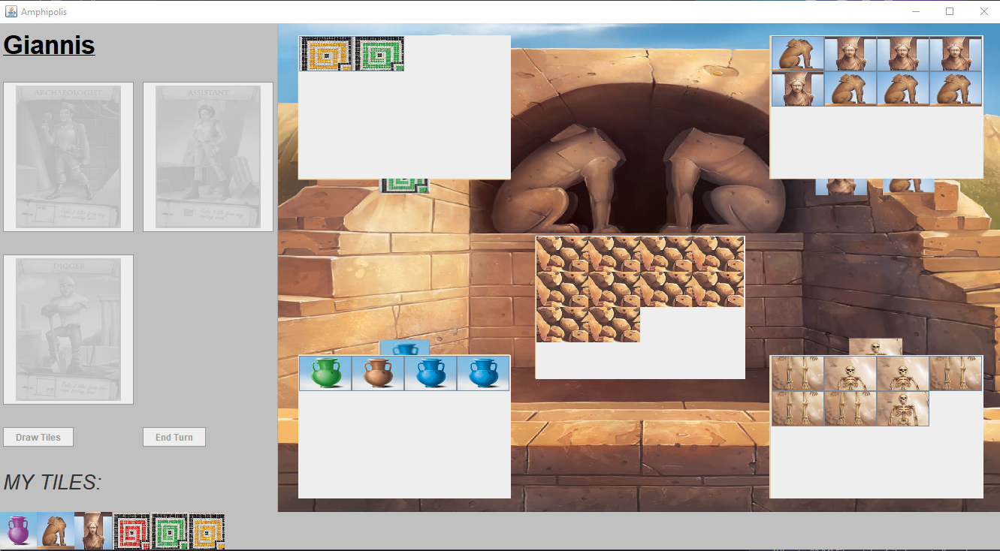
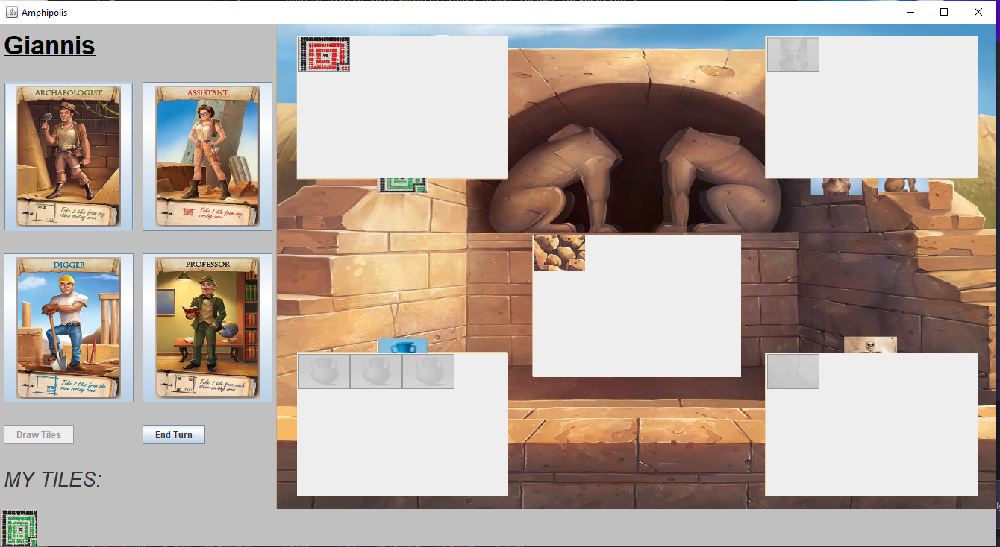

# Amphipolis-Game
Engaging Amphipolis board game implementation using Java technology.

## Introduction

"Amphipolis" is a Java game project that offers an immersive learning journey in Java programming. From problem-solving to project structuring and debugging, it provides invaluable insights. Through its development, one gains practical experience in object-oriented programming, game mechanics, and user interactions. By focusing on Java syntax, data structures, and algorithms, "Amphipolis" enhances understanding of programming concepts while honing game development skills. Additionally, the project includes UML diagrams derived from the game for further analysis and documentation.

## Screenshots

 

## Instalation and Play

1. Open the project using IntelliJ and ensure JDK 15.0.1 Java version for successful execution. The main class is located in myMain.java.

2. Clicking the Play Button displays the game board along with two additional panels for the randomly selected starting player.

3. Areas of the tiles are initialized beforehand, and buttons cannot be clicked initially.

4. The player can make their initial selection by choosing "Draw Tiles." Clicking the corresponding button adds 4 new tiles from the assumed bag to the areas, making them clickable.

5. The remaining option buttons become clickable only if the player has at least one tile.

6. Clicking "End Turn" loads the panels for the next player.

7. This process repeats until all 16 landslides are filled.

## Contributing

Contributions are welcome! If you have any suggestions or improvements for the Amphipolis Game, please submit a pull request. For major changes, please open an issue first to discuss the proposed changes.

## License

This project is licensed under the [MIT License](LICENSE).
